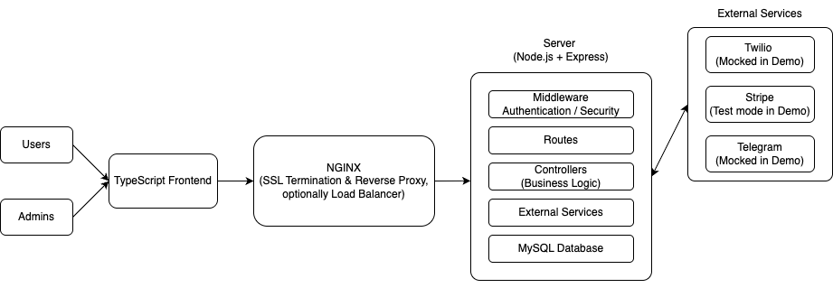

# System Architecture

This document outlines the architectural components of the **Rserv** web application.

---

## Overview

Rserv is a full-stack reservation system with two interfaces:

- **Customer flow**: Mobile-first reservation experience
- **Admin portal**: Settings and reservation management

The system is built as a **monolithic app** using a modular structure.

---

## Stack Summary

| Layer          | Technology                         |
| -------------- | ---------------------------------- |
| Frontend       | React + TypeScript + Tailwind/SCSS |
| Backend        | Node.js (Express)                  |
| Database       | MySQL                              |
| Deployment     | DigitalOcean Droplet               |
| Web Server     | NGINX + Certbot                    |
| CI/CD          | GitHub Actions                     |
| Auth           | JWT in secure, HTTP-only cookies   |
| 3rd-Party APIs | Twilio, Stripe, Telegram           |

---

## Component Flow

> 📄 Original diagram file: [architecture.drawio](./drawio/monolith_architecture.drawio)

- All API requests pass through Express
- Authenticated sessions use cookies with `SameSite=Lax`
- NGINX handles HTTPS termination and proxies to Node.js
- PM2 manages app uptime and restarts on the server

---

## Authentication Model

- **User login**: JWT set in `res.cookie()` with secure, httpOnly flags
- **Reservation flow**: Separate short-lived token for anonymous users
- Tokens expire and are rate-limited per action (see `security.md`)

---

## Deployment Lifecycle

- Code pushed to `main` triggers a GitHub Actions pipeline:
  - Installs dependencies
  - Builds frontend
  - SSH into server
  - Runs `git pull`, `npm install`, `pm2 restart`

See [Infrastructure & Deployment Guide](infra.md) for full deployment setup.

---

## Scaling Considerations

- All state is stored in MySQL
- Rate limiting is done per-IP via middleware
- Future options include:
  - Redis for session tracking
  - Service separation (auth, bookings)
  - Caching availability data
